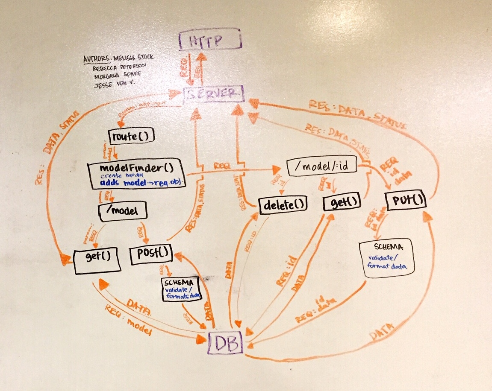

 LAB
=================================================

## Documenting an API server

### Author: Melissa Stock

### Links and Resources
* [submission PR](https://github.com/401-advancedjs/api-server-classes/pull/1)
* [travis](https://www.travis-ci.com/401-advancedjs/api-server-classes)

#### Documentation
* [jsdoc](https://jsdoc.app/about-getting-started.html) (Server assignments)

### Modules
#### `v1.js`
#### `404.js`
#### `500.js`
#### `model-finder.js`
#### `categories-model.js`
#### `players-model.js`
#### `players-schema.js`
#### `teams-schema.js`
#### `teams-model.js`
#### `memory-model.js`
#### `mongo-model.js`

##### Exported Values and Methods

###### `modelFinder(resource) -> new Model`
Finds the correct model to build based on the resource

###### `handleGetOne(req, res, next) -> object`
Handles getting one JSON object

###### `handleGetAll(req, res, next) -> object`
Handles getting all of the JSON objects

###### `handlePost(req, res, next) -> object`
Handles adding one JSON object

###### `handlePut(req, res, next) -> object`
Handles updating one JSON object

###### `handleDelete(req, res, next) -> object`
Handles deleting one JSON object

###### `404(req, res, next) -> status`
Sends 404 error

###### `500(err, req, res, next) -> status`
Sends 500 error

### Setup
#### `.env` requirements
* `PORT` - 3000
* `MONGODB_URI` - URL to the running mongo instance/db

#### Running the app
* `npm start`
* Endpoint: `/:model`
  * Returns a JSON object with all selected models in it.
* Endpoint: `/:model/model`
  * Returns a JSON object with model that has specified id in it.
  
#### Tests
* How do you run tests?
* What assertions were made?
    * should respond with a 404 on an invalid route
    * should respond with a 404 on an invalid method
    * should be able to post to a valid model
    * following a post to a valid model, should find a single record
* What assertions need to be / should be made?
  * records can be deleted
  * records can be updated

#### UML
 LAB
